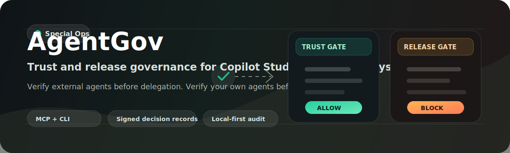

<div align="center">



# AgentGov for Copilot Studio

### Trust and release governance for multi-agent Copilot Studio systems

> **Verify external agents before delegation. Verify your own agents before release.**

[](LICENSE)
[](https://nodejs.org/)
[](tsconfig.json)
[](https://modelcontextprotocol.io/)
[](https://copilotstudio.microsoft.com/)
[](https://github.com/a2aproject/A2A)
[](https://www.microsoft.com/en-us/security/blog/2026/05/01/microsoft-agent-365-now-generally-available-expands-capabilities-and-integrations/)

[Quickstart](#quickstart) · [Architecture](#architecture) · [Demo](#demo) · [Threat model](docs/threat-model.md) · [Cost model](docs/cost-model.md) · [Prior art](docs/prior-art.md)

</div>

---

## The two questions Copilot Studio doesn't answer for the maker

Microsoft Copilot Studio shipped multi-agent A2A in **April 2026** and [Microsoft Agent 365](https://www.microsoft.com/en-us/security/blog/2026/05/01/microsoft-agent-365-now-generally-available-expands-capabilities-and-integrations/) on **May 1, 2026**. Two governance questions remain open for makers and Center of Excellence teams:

<table>
<tr>
<td width="50%" valign="top">

### Inbound trust

> Can my agent safely delegate to **this external A2A agent**?

The **Trust Gate** fetches the external agent's [`/.well-known/agent-card.json`](https://github.com/a2aproject/A2A/blob/main/docs/specification.md), verifies its JWS signature against a pinned trust registry, scans metadata for prompt injection, sanitizes if recoverable, and returns one of:

```text
ALLOW · ALLOW_SANITIZED · REVIEW · BLOCK
```

</td>
<td width="50%" valign="top">

### Outbound release

> Is my **own agent** trustworthy enough to ship to users?

The **Release Gate** generates a structured test set from the agent profile and policy YAML, ingests Copilot Studio Evaluation API results, asserts expected vs actual tool calls, classifies failures with regression-over-time detection, and emits:

```text
PASS · WARN · BLOCK
```

</td>
</tr>
</table>

Every decision — trust or release — is **HMAC-signed**, **idempotent**, **instrumented with OpenTelemetry GenAI semantic conventions**, and persisted to **local SQLite by default**. Dataverse and SharePoint adapters available.

---

## How AgentGov fits the existing stack

**AgentGov is not a replacement.** It is the maker/CoE evidence-producing layer that other governance tools consume.

| Layer | Tool | Where AgentGov sits |
|---|---|---|
| Enterprise control plane | [Microsoft Agent 365](https://www.microsoft.com/en-us/security/blog/2026/05/01/microsoft-agent-365-now-generally-available-expands-capabilities-and-integrations/) | AgentGov produces signed trust/release evidence Agent 365 consumes |
| CI/CD merge gate | [EvalGateADO](https://microsoft.github.io/CopilotStudioSamples/testing/evaluation/EvalGateADO/) | EvalGateADO gates merges; AgentGov gates **human release readiness** |
| Card signing infra | [sigstore-a2a](https://github.com/sigstore/sigstore-a2a) | sigstore-a2a signs; AgentGov **enforces tenant trust policy + sanitization** |
| Runtime audit | [Microsoft Purview](https://learn.microsoft.com/en-us/purview/ai-copilot-studio) | Purview audits runtime; AgentGov governs the **decision lifecycle** |
| Runtime moderation | Guardrails AI / Lakera / Aporia | Adjacent — runtime, not governance-lifecycle |

Full comparison: **[`docs/prior-art.md`](docs/prior-art.md)**.

---

## Quickstart

```bash
git clone https://github.com/oneKn8/agentgov.git
cd agentgov
npm install
npm run build
npm test && npm run test:smoke
```

### Trust Gate — block a poisoned external A2A agent

```bash
agentgov trust check fixtures/agent-cards/poisoned-injection.json --offline
```

```jsonc
{
  "verdict": "BLOCK",
  "risk_score": 100,
  "reasons": [
    "Agent Card is unsigned",
    "No provider/domain match in tenant trust registry",
    "Instruction-like prompt-injection text found in Agent Card metadata",
    "External URL present in orchestration metadata"
  ],
  "findings": [ /* 4 findings with citable evidence */ ],
  "signature": "j8xKIMGTPiKGVsBFACRB4m_Ni58IaUK0AN4ZqprZUkg"
}
```

### Trust Gate — allow a signed, registered agent

```bash
agentgov trust check fixtures/agent-cards/trusted-signed.json --offline
```

```jsonc
{
  "verdict": "ALLOW",
  "risk_score": 0,
  "registry_match": true,
  "signature_valid": true,
  "signature": "diwN192QbCOF8Ms13ceNsZhJ-3GxZNSGjmitE3GL004"
}
```

### Release Gate — block an unready Copilot Studio agent

```bash
agentgov release check target-agents/vendor-exception.yaml \
  --eval fixtures/eval-results/block.json
```

Output: a `BLOCK` packet for a Vendor Exception Agent that approved a $50K exception without calling the policy-lookup tool and without finance approval. Markdown packet written to `outputs/release-packet.md`. Signed decision persisted to SQLite.

### Policy as code

```bash
# Validate policy YAML
agentgov policy validate policies/vendor-exception.yaml

# Generate a release test set from a target agent profile
agentgov policy testset target-agents/vendor-exception.yaml --csv outputs/tests.csv

# Run policy unit tests
npm test

# Verify the HMAC signature on a stored decision record
agentgov signature verify outputs/release-decision.json

# Revoke a release post-deployment (audit-logged, immutable)
agentgov release revoke <release_id> --reason "post-release regression"
```

**Audit by default.** Trust and release decisions are persisted to SQLite even in `--offline` mode. Every decision is an auditable, verifiable record.

---

## MCP server (Copilot Studio integration)

```bash
npm run mcp:start
# AgentGov MCP listening at http://localhost:3000/mcp (Streamable HTTP)
```

Full Copilot Studio + Power Automate + Dataverse + Entra OAuth setup with troubleshooting: **[`docs/wiring.md`](docs/wiring.md)**.

---

## Architecture


One MCP Streamable HTTP server, two tool families (6 trust + 8 release), one signed decision schema, one Dataverse / SharePoint / SQLite decision table, one CLI.

| Surface | Tools |
|---|---|
| **Trust Gate** | `inspect_agent_card` · `verify_card_signature` · `check_trust_registry` · `scan_card_metadata` · `sanitize_agent_card` · `issue_trust_verdict` |
| **Release Gate** | `generate_release_tests` · `ingest_eval_results` · `assert_tool_calls` · `classify_release_risk` · `recommend_remediation` · `compose_release_packet` · `persist_decision` · `revoke_release` |
| **CLI** | `agentgov trust check` · `agentgov release check` · `agentgov release revoke` · `agentgov policy validate` · `agentgov policy testset` · `agentgov signature verify` |

Trust lifecycle: [`docs/architecture-trust.png`](docs/architecture-trust.png) · Release lifecycle: [`docs/architecture-release.png`](docs/architecture-release.png)

---

## What makes this production-grade

| Pillar | What it looks like |
|---|---|
| **Policy as code** | YAML rules with unit tests in [`policies/__tests__/`](policies/__tests__/). Auditable, versionable, diff-able. |
| **Signed decisions** | HMAC-SHA-256 over RFC 8785 (JCS) canonical payload. Independently verifiable via `agentgov signature verify`. |
| **Threat model** | Full STRIDE coverage in [`docs/threat-model.md`](docs/threat-model.md) — poisoned cards, prompt injection, replay, tamper, downgrade, impersonation. |
| **Cost model** | [`docs/cost-model.md`](docs/cost-model.md) — **$0/month free tier validated**. No paid LLM calls in the core decision path. |
| **Observability** | OpenTelemetry [GenAI semantic conventions](https://opentelemetry.io/docs/specs/semconv/gen-ai/) spans on every decision. [`docs/observability.md`](docs/observability.md). |
| **Data minimization** | No raw sensitive payloads in audit logs. Evidence referenced by ID. Redaction at the persistence boundary. [`docs/data-minimization.md`](docs/data-minimization.md). |
| **Regression detection** | Each release compared against last 5 runs. Pass-rate drop ≥5pp or new failure category → `WARN`. |
| **Idempotency + revocation** | Same `release_id` → same record. `POST /releases/{id}/revoke` appends audit row without rewriting history. |
| **Local-first** | SQLite default. Dataverse and SharePoint as adapters behind a clean `Storage` interface. |
| **MCP + CLI parity** | Every capability via both surfaces. CLI runs without Copilot Studio. |

---

## Demo

5-minute walkthrough: [`docs/demo-script.md`](docs/demo-script.md)

```text
0:00  HOOK      The two governance questions Copilot Studio doesn't answer
0:25  ACT 1     Trust Gate BLOCKs a poisoned external A2A agent (live)
2:00  ACT 2     Release Gate BLOCKs an unready Vendor Exception Agent (live)
3:30  FLOW      Adaptive Card approval routes to the owner via Power Automate
4:00  ARCH      One MCP, two tool families, signed decision schema
4:30  CTA       github.com/oneKn8/agentgov
```

---

## Roadmap

- [ ] Sigstore-keyless decision signing via GitHub OIDC
- [ ] SLSA Level 3 provenance for the MCP server itself
- [ ] Cross-tenant trust registry (federated agent directory)
- [ ] Native Microsoft Agent 365 webhook integration
- [ ] Bring-Your-Own-LLM mode for sovereign / air-gapped tenants
- [ ] Community policy marketplace
- [ ] Regression-detector trained ML model

---

## License

[MIT](LICENSE)

## Security

[`SECURITY.md`](SECURITY.md) — do not file public issues for security reports.

## Contributing

[`CONTRIBUTING.md`](CONTRIBUTING.md) · [`CODE_OF_CONDUCT.md`](CODE_OF_CONDUCT.md)

---

<div align="center">

**Built for [Microsoft Agent Academy Hackathon 2026](https://microsoft.github.io/agent-academy/events/hackathon/) — Special Ops track**

</div>
